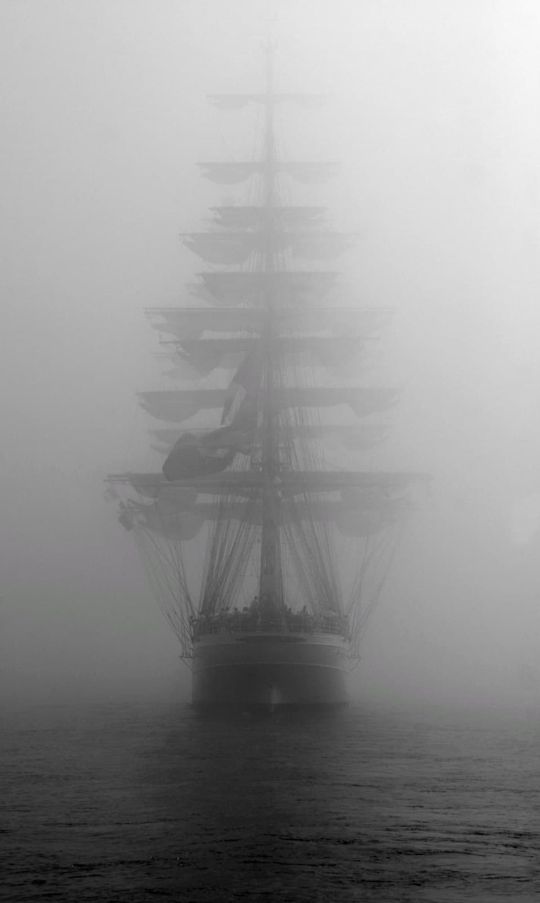

&ensp;&ensp;&ensp;&ensp;I've always wanted to write some sort of blog for myself. Perhaps because I thought it would be cathartic, or because I wanted some place besides my spam to put down some deeper thoughts.
So since this is the first time I'm writing here I just wanted to perhaps explain what this will be. Perhaps it will change in the future, but right now I think this will just be a place
of reflection. Some stories, some philosophical thoughts even. My writing skill is probably not going to be that good
so I don't expect to write a poetic masterpiece or anything, but I hope I can write well enough to convey what I'm thinking accurately. Most of what I write will probably be inspired 
by something I saw or witnessed.

Such is the case with this first post. I was scrolling through Reddit when I saw this picture:

&ensp;&ensp;&ensp;&ensp;I had always imagined as a kid that if I was alive back in the 1600s or 1700s, I would have taken up life as a sailor. When I think about it, I think what really resonates with me about
the sailing life is the freedom and the sense of adventure. In a sense I guess I've always been a sucker for adventure. But the picture really spoke to me at a deeper level because as
I looked at the picture, I could almost imagine how it would have felt to be a medieval sailor. To be alone on the sea for months on end, and then suddenly on a foggy morning, another ship slowly 
emerges from the mist. Two ships crossing paths is almost unthinkable when the ocean is so vast, yet I can still imagine the trepidation, the excitement. And even though sailing is hard, dirty work,
perhaps on that morning I would forget about all of that. Our two ships would lay anchor, and I'd throw a plank across. And as the sea roars below me, I would carefully balance myself on the slightly
swaying plank and make my way across to the other ship. Perhaps our two crews would tell stories, even maybe throw a little party. And despite how shitty life must be as a sailor, I can't help but 
imagine that I might be happy with it. I can't help but feel like I would be fulfilled, that I would have a purpose.

&ensp;&ensp;&ensp;&ensp;I think that's what really gets me about quarantine. Sure the loneliness sucks and it's harder than ever to concentrate on schoolwork, but what really sucks is that quarantine has sucked away
my sense of fulfillment and purpose. Every day feels like a chore to get through, and even though I'm making progress toward my degree and my career, I don't think I care about that at all. In 
fact, I don't even know why I felt fulfilled before quarantine. Wasn't I doing the exact same thing before though? I was working toward my degree and my career, yet now it's lost its meaning. 
In the wake of this, I've had a thought that I don't think I've ever had before: Would it have been better if I wasn't born at all? It' a strange thought, not born out of sadness or 
loneliness even, but instead boredom. When going through each day seems so tedious, and the tedium really has no reward, 
I think it's natural to begin to wonder if the tedium is even worth it. Because if I wasn't
born, then I wouldn't have to go through all of the mindnumbingly useless things that are required of me every day. Sure I would miss out on many great things that happened, but does it balance out in my favor?
Am I at a net positive or net negative for my life? It's a pretty depressing thought.

&ensp;&ensp;&ensp;&ensp;So I've been thinking more about what makes a fulfilling life. Or at least what makes a life worth living. Relationships with people come to mind first, but I think there is also something else.
I've always had random thoughts about apocolypse and what I would do if I survived. If I was able to make it out with a few friends, we could go find a nice place somewhere in nature and try to set up
a new, frugal life. And even though I would need to work so hard just to survive, I think I would be fulfilled. In a sense the goal every single day would be to just stay alive, and I would have clear steps
to work toward that goal. Gather wood, gather food, maybe do some farming. Even though it's simple, tedious stuff, it has purpose. At night we could perhaps sit next to the fire and admire the stars shining
as brightly as ever. Even though life should theoretically be more boring than it is now, I can't help but feel that it would be fulfilling. Despite all the menial tasks we would need to complete every day
just to survive, it would be a life worth living.
It's really strange when I think about it but I guess because each task has a purpose, it becomes fulfilling.
That sounds really simple but I've never thought of it like that. I think the main reason why those tasks become infused with purpose is because the purpose is so simple and clear. It's just
to stay alive. Everyone can understand that purpose and it's easy to connect how gathering resources helps you not die. But in modern times there is no simple purpose in life. 
Staying alive is easy, living is not. Each of the tasks I do everyday, I don't know why I do them. Is it because
I want get hired? To make money? For what? It's something I need to think about more.

&ensp;&ensp;&ensp;&ensp;But yeah, going back to the ship, would I trade my life right now for the life of a sailor? I think if I didn't have any friends I would do it. As it is, my life by itself is pretty worthless. In fact,
looking through my memory, I don't think I have a single good memory that is just me by myself. All the moments of brilliance in my life are with other people, and all the things I want in the future
are with other people. I guess maybe that's my purpose huh. Maximize those moments with others. Honestly, that's not too bad of a way to live. But still, I think these memorable moments in my life are still
too few and far between. In a sense they're almost like ships meeting at sea. Well, maybe a little bit more common. But I guess that just means I need to travel further, travel faster, so maybe I might see a ship
appearing out of the fog a little bit more often.