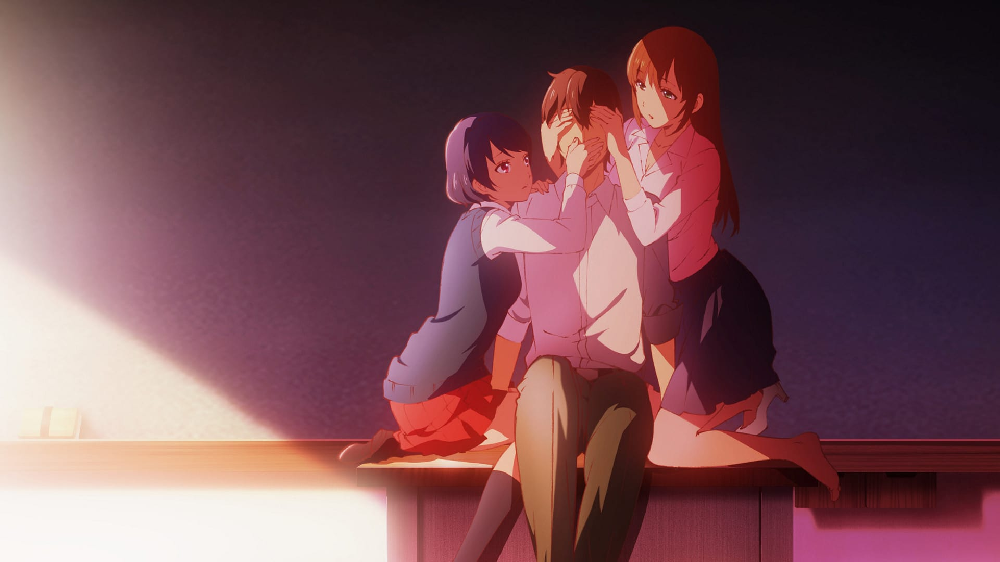
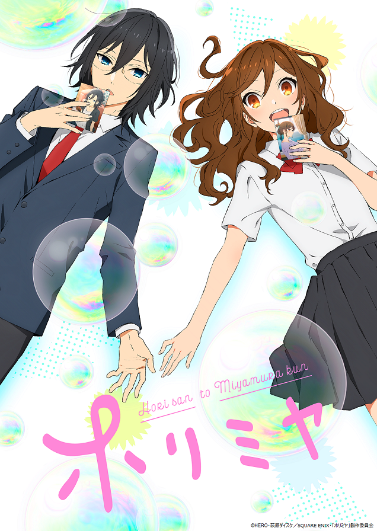

During quarantine one of my guilty pleasures has been watching romance anime. Perhaps it’s because I’ve been lacking love myself? Whatever the reason may be, I decided to write a review of five romance anime that I’ve watched. I’ll be ranking them and even though I enjoyed all five of them to some extent, there’s definitely something about a good romance that distinguishes it from a bad romance. Honestly I’m not too sure myself what that secret factor is, but I hope maybe I can discover it as well as I write this review.
The five anime I’ll be reviewing are:
- *The Quintessential Quintuplets*
- *Rental Girlfriend*
- *Domestic Girlfriend*
- *Kaguya-sama: Love is War*
- *Horimiya*

So let’s begin I guess.

## 5. The Quintessential Quintuplets

Although it was pretty hard to pick which anime was my favorite, *The Quintessential Quintuplets* (from here on referred to as QQ) was definitely my least favorite. The plot basically revolves around a really smart student named Fuutarou. He’s a genius who gets 100% on every test. Fuutarou’s family, however, is in poverty and he lives an extremely frugal lifestyle. One day, Fuutarou’s dad finds him a tutoring job tutoring quintuplets who all eventually fall in love with him. 

In Japan, this genre is known as harem—where a lot of girls try to win over one guy. In harems, the story generally revolves around each girl’s attempts to become the girl most deserving of the main character. The reason why I didn’t like QQ that much is because there were just too many girls. I think it was just too difficult to give each girl solid character development which resulted in all the girls feeling somewhat shallow and forgettable. I also think the ending was sort of rushed, and didn’t really make sense given the story’s progression. In addition, the story itself was pretty much a generic harem, and felt extremely cookie cutter and uninspired. I also felt that the girls themselves didn’t really act like real humans, mainly in that they were just too nice to each other despite being in competition. I guess the girls are sisters, but it was still extremely weird how all the girls are trying to get with one dude, but they’re supporting each other while also trying to win that dude over.

Despite these flaws, I think the premise was still pretty unique. There were many situations in the show which could have only happened with quintuplets, such as when one of the girls kissed Fuutarou, but he couldn’t tell who it was. It was moments like these that I think the author did a good job not really giving away who would win up until the very end. The art was excellent, and did a good job distinguishing each girl, despite their obvious similarities. And although I felt the characters themselves were underdeveloped, the reason why each girl fell in love with Fuutarou was well explored.

All in all, however, QQ still falls short for me. This is mainly because in a harem, I believe character development is the most important part of the story. Without giving the viewer a deeper understanding of each girl, it makes it really hard for the viewer to really care about who wins. At least that’s how I felt watching/reading QQ. I honestly just didn’t really care about the main character, or who he would pick. This made the story somewhat unabsorbing and I never felt any moments of warmth or really even love. It all felt kinda shallow and I wasn’t even aware that Fuutarou even liked any of the girls until the very end. So I guess what I would say about QQ is that I recommend it to anyone who wants to kill time since it is a fun watch, but if you’re looking for deeper elements of romance that really explore human relationships, you won’t really find it in QQ.
## 6/10

## 4. Domestic Girlfriend

First thing’s first, this anime is a complete dumpster fire. The premise alone is enough to make one gag at how brightly and nastily this anime burns. Basically, this guy sleeps with this girl he meets at a mixer. This guy also happens to be in love with his teacher. He then finds out that his dad is getting remarried, and his new step-sisters are the teacher he’s in love with, and his one night stand. From there we follow an incest love triangle as the main character (Natsuo), decides whether he loves his teacher (Hina), or the random girl he lost his virginity to (Rui). 

*Domestic Girlfriend* is also of the harem genre, although there are significantly less girls this time. The main battle is between Rui, the little sister, and Hina, the teacher and older sister. Given the smaller cast, I feel like *Domestic Girlfriend* succeeds where QQ failed. Hina and Rui are both given ample time to become more nuanced and developed characters. They aren’t defined by just one personality trait, and in many ways, both Hina and Rui are similar. This nuance really makes the harem more meaningful and makes the MC’s choice that much harder. Where this anime truly shines, however, is just in how spicy it is. Every single episode, something absolutely ridiculous happens. And even though the situations that occur in this anime would never happen in real life, they are believable enough to not be completely dismissed. This makes for some screen-gluing (is this even a word?) storytelling that you just can’t look away from no matter how much you try. This show really embraces its own absurdity and leverages it to craft some truly spicy spicy spicy plotlines. Despite how many times I rolled my eyes while watching this anime, I can’t say that I didn’t enjoy it. In fact, I enjoyed it quite a bit. The art is really quite good as well, and has perhaps one of my favorite faces in all of anime: pouting Rui.

Besides how ridiculous this show is, I feel like the storytelling itself is pretty logical and sensical. The author actually thinks a lot of things through, and makes her characters act pretty naturally in the situations she puts them in. This not only lends itself to the “realism” of the show, but also gives all the spice a backbone to work off of. Thus, given that I actually enjoy just how stupid some of the premises in this show are, I don’t think I really have anything bad to say about this show. It’s really quite an amazing show that will 100% entertain you. So even though *Domestic Girlfriend* is a dumpster fire, maybe we’re looking at a Beverly Hills dumpster fire here, where all they’re burning is like old Gucci shirts or something. 

Oh yeah, and the OP is an absolute [banger](https://www.youtube.com/watch?v=0YF8vecQWYs).
## 8.5/10

## 3. Horimiya

Honestly I had a really hard time choosing between the top three. They are all really close in my mind but given just what I like, I think *Horimiya* comes in at a solid 3rd place. *Horimiya* is actually the latest romance anime I’ve watched, and it chronicles the friendship and love of Hori, a slightly tsundere and caring girl, and Miyamura, a tough-looking but gentle boy. *Horimiya’s* main theme at the start is looking past appearances. In the beginning, Hori is introduced as a studious and popular girl, who is actually a hardworking daughter at home, while Miyamura is introduced as a nerd and otaku. It turns out that Miyamura has 9 (count em) piercings as well as some tattoos, which he hides leading to others perceiving him as moody and gloomy. One day Miyamura meets Hori out in the wild and the two hit it off, spending time with each other as their “other” side. 

The premise is really simple and I think *Horimiya* is truly probably the only slice of life anime I’ve really enjoyed. First of all, in *Horimiya* the main couple actually get together right away! That’s actually pretty incredible in anime because usually the story chronicles the “getting together” not what happens after. But I think *Horimiya* is less about the “falling in love” and more about the “being in love”. To that extent, *Horimiya* is one of the most wholesome and heartwarming animes I’ve watched. Because the series is so focused on Hori and Miyamura, we get to know the two characters intimately as well as the dynamics of their relationship. It’s easy to see that the two of them love each other, and instead of skirting around the love for ages, the anime actually puts them together right away. From there, we explore their relationship further as they learn more about each other and fall deeper in love. 

It really is hard to put a finger on what makes *Horimiya* good, and where it succeeds where other shows have failed, but I think the main reason why the story carries such weight is just how realistic and pure their love is. They love each other for each other, which may sound like “duh” but usually love does carry some ulterior motive. Either loving the other person’s beauty, or their intelligence, or maybe just loving the feeling of having someone. In *Horimiya*, it really feels like there’s no ulterior motive. Hori and Miyamura truly have this pure love that I think everyone longs for. The unconditional, unadulterated love like a mother’s love for their child. There’s no spice, nothing absurd happens, but just watching Hori and Miyamura interact is just so wholesome. 

I think the show is able to show this level of love between the two because of the work it puts in building up Hori and Miyamura’s relationship. The show spends a significant amount of time in the beginning just showing us how the two interact, giving us insight into each person’s personality as well as how they view one another. I think this show is truly something special and even though it’s so heartwarming, it will actually make you depressed because you’ll know that you’ll never have what they have. Sadge

*Horimiya* also has a pretty good [OP](https://www.youtube.com/watch?v=haJwpsJ4Uj4).
## 9/10

## 2. Rental Girlfriend

*Rental Girlfriend* is another trashy, dumpster fire harem that I actually genuinely love. Despite it also being a spicy show (second only to *Domestic Girlfriend*), I feel like the spice isn’t really the reason why I like the show. 

To start, the premise is also pretty stupid. Basically the main character, Kazuya, is a loser who gets dumped by his first girlfriend as soon as the story starts. To cope with the pain of the breakup, Kazuya rents out a girlfriend and right before the date is over, the rental girlfriend holds his hand. After the date, Kazuya is ecstatic, feeling as if he’s special and that something might actually exist between the rental girlfriend himself, however reading the girl’s reviews quickly brings him back down to Earth as he realizes that the girl has held hands with other people on their dates. This makes Kazuya pissed for some reason so he rents her (Mizuhara) out again, and this time decides to absolutely shit on her in public because he harbors this petty grudge against her. This, rightly so, pisses Mizuhara off and she lets her true self show a little bit over her rental girlfriend facade. Anyway, one thing leads to another and Kazuya visits his grandmother and tells his grandma that Mizuhara is his girlfriend. Mizuhara’s grandmother also happens to be there and Mizuhara tells her grandma that Kazuya is her boyfriend. From there, he’s unable to stop lying, telling basically everyone that Mizuhara is his girlfriend. He’s also unable to “break up” with Mizuhara because his grandmother likes Mizuhara so much and Mizuhara doesn’t want to make her grandma sad either. So Kazuya and Mizuhara maintain this relationship of client and girlfriend in order to not ruin each other’s lives.

The premise is kinda insane looking back but to be honest, I think this story shines in the strength of its characters. Mizuhara Chizuru is the main girl, and she is basically the perfect girlfriend. Out of all the anime girlfriends I’ve seen, Mizuhara is probably the closest to being a real human. She’s not perfect, but she tries to be. She’s extremely independent, but also vulnerable at times. She will protect the people she loves, but she’s also not afraid to tell them when they’re wrong. She’s not a pushover, but also not too cold. She’ll cook for you, and support you when you’re down, and she’s not too proud to not ask others for help. All of these traits make her such a nuanced and complex character, but mainly, she’s just a really good person. This is all in contrast to Kazuya, who is deeply flawed. He definitely is too horny, is very selfish, and has a host of other traits that make him really pitiful. Despite this, he is the main character and although *Rental Girlfriend* is a harem, I don’t think it’s like any other harem.

Usually in harem, the MC is a decent person who is actually someone every one of the girls can fall in love with. But in *Rental Girlfriend*, that couldn’t be further from the truth. Kazuya truly doesn’t deserve anyone, at least at the beginning. But I think this is where *Rental Girlfriend* truly shines. “Good characters don’t have to be good people”. Kazuya’s flaws make *Rental Girlfriend* less of a harem, and more of a redemption story. Can Kazuya become a man worthy of Chizuru? Can he change all the things that make him such a loser, and actually become a man that Chizuru can fall in love with? In short, *Rental Girlfriend* sets itself up for one of the most promising character development arcs I’ve ever seen. I truly think a gift of humanity is our ability to change, and I believe that as the story of *Rental Girlfriend* progresses, we will watch Kazuya blossom from a virgin caterpillar into a chad butterfly.

Aside from my hopes for the character development arc, I think the story itself is also pretty unique, exploring the struggles of maintaining an image in a modern society. The rental girlfriend premise also allows the story to put Kazuya and Mizuhara into intimate situations without them actually being together which I also found very interesting. To be honest, I think I like *Rental Girlfriend* so much because I feel like there’s genuine progression in the story. Spice isn’t there just for the sake of spice, and the story doesn’t continue just because the author wants more money (although I’m sure he does).  Change is slow and even though the story isn’t finished, Kazuya has definitely changed from when the story began. In a sense, love is driving him to improve himself, and that premise is what makes this such a good romance.

Continuing the trend, the OP is a [banger](https://www.youtube.com/watch?v=eCDJo1rXOW4).
## 9.2/10

## 1. Kaguya-sama: Love is War

*Kaguya-sama* just hits different. Out of the five anime on this list, I think *Kaguya-sama* made me experience the largest range of emotions, from childish giddiness to genuine sadness. As a rom-com, the story follows Kaguya and Shirogane, the Vice President and President (respectfully) of their school. Both of them are geniuses and they also both happen to like one another. But both Kaguya and Shirogane are too prideful to confess their love first and so they engage in a “war” where they try all sorts of things to get each other to confess. The plot is basically like texting mind games x100.

To be completely honest, I tried watching *Kaguya-sama* a while ago but I couldn’t really get into it. The premise seemed kinda stupid and why would you watch a romance where the entire premise is the fact that the two main characters aren’t going to get together? But to be honest, even though Kaguya and Shirogane probably won’t ever date, the two manage to reach a level of intimacy and love that people who are dating maybe don’t even reach. They truly are head over heels for each other and that fact makes everything they do that much more absurd. The lengths Kaguya and Shirogane go to win just a tiny battle lends itself to some of the most genuinely funny and sometimes heartwarming moments I’ve ever seen. Many times while watching I’ve had to pause to just laugh silently to myself like a maniac.

I think what really makes this show work is just how likeable the characters are. Kaguya has a tough facade, but in reality she’s just a sheltered girl experiencing her first love. Shirogane may be the smartest person ever, but when it comes to love he’s just clueless, and apparently is deathly afraid of being called adorable by Kaguya. The dynamic between Kaguya and Shirogane is like children playing with each other, and even though the two are technically at “war”, they always put the other person first.

Even though the main characters are extremely well developed, the side characters also play an important role. Perhaps the most important side character is Secretary Chika who acts as an X-factor to all of Shirogane’s and Kaguya’s meticulously crafted plans. Despite how well thought out a plan might be, clueless Chika always manages to ruin it. And I’ve also heard (from sources unknown) that the Chika dance is actually holy water in video form.

I also feel that *Kaguya-sama* doesn’t shy away from the heavier stuff, despite the show’s light-hearted tone. It showcases Kaguya’s family life and gives us backstory on why she became so fierce and independent when in reality she’s just like any other girl put in a situation beyond her depth. It truly is the only show where I feel like I genuinely love the characters and all I want is for Kaguya and Shirogane to be happy. And even though the show never explicitly makes them date, it produces these special moments where Kaguya and Shirogane share their love silently, such as walking home under one umbrella. It’s these moments that really allows us to glimpse what could be and those moments are just so wholesome and satisfying. All in all, *Kaguya-sama* is just so enjoyable to watch and I feel like it really is just a complete experience despite the lack of “romance”. 
## 9.5/10

In conclusion, I honestly still don’t know what the secret factor is that makes a good romance, but I think one of the most important things is to have a genuine love that’s clearly and powerfully shown. Without that, I feel like the story itself just falls apart because the basis of the story (the love) just isn’t there. If there is a genuine love between the characters, I feel like anything can work (such as in *Kaguya-sama*). So I guess in the end the conclusion is that the secret sauce is love. Wow who would have thought? Still I guess things like this hide in plain sight huh.
